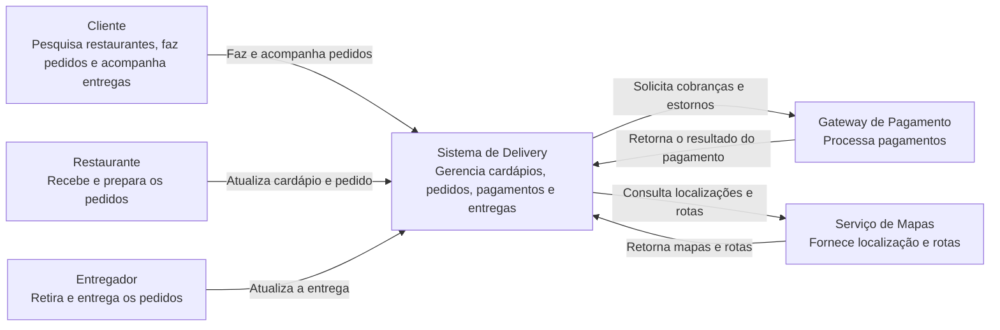
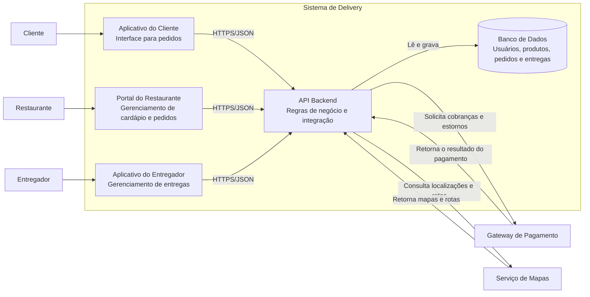
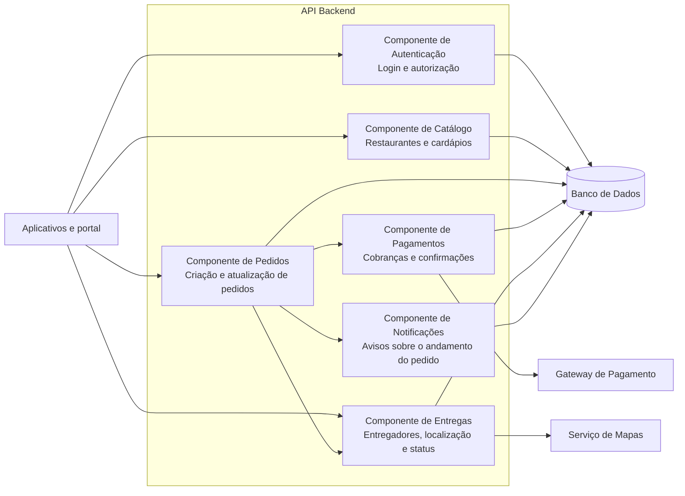
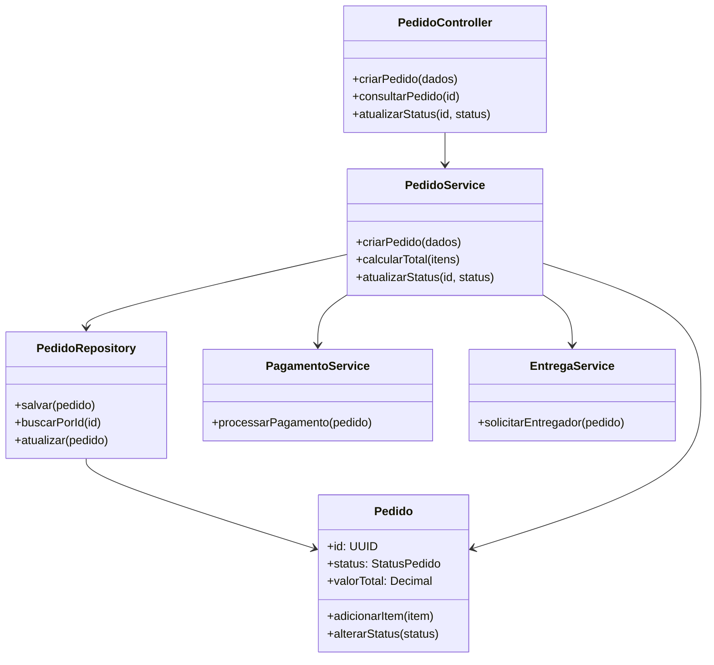

# Atividade — Modelo C4 de um Sistema de Delivery

## 1. Sistema escolhido

O sistema escolhido é uma plataforma de delivery de comida. Ela permite que clientes encontrem restaurantes, façam pedidos, realizem pagamentos e acompanhem a entrega.

### Arquivos da atividade

- `c1-context.mmd`: diagrama de contexto do sistema.
- `c2-context.mmd`: diagrama de contêineres.
- `c3-components.mmd`: diagrama de componentes da API Backend.
- `c4-code.mmd`: diagrama de código do componente de pedidos.

## 2. Nível 1 — Diagrama de contexto

O diagrama de contexto apresenta o sistema como um todo, seus usuários e os sistemas externos com os quais ele se comunica.

## 3. Nível 2 — Diagrama de contêineres

Este nível mostra as principais aplicações e bases de dados que formam o sistema.

## 4. Nível 3 — Diagrama de componentes da API

O terceiro nível detalha os componentes internos do contêiner **API Backend**.

## 5. Nível 4 — Diagrama de código do componente de pedidos

O quarto nível representa uma possível estrutura de classes do componente de pedidos.

## 6. Conclusão

O modelo C4 permite observar o mesmo sistema em diferentes níveis de abstração. O diagrama de contexto mostra as relações externas; o de contêineres apresenta as aplicações e os dados; o de componentes detalha a organização interna da API; e o diagrama de código representa as classes de uma parte específica do sistema.
