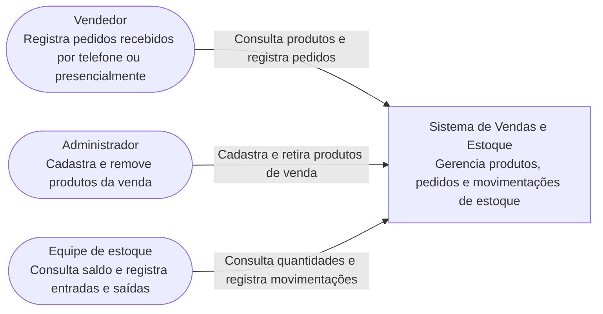
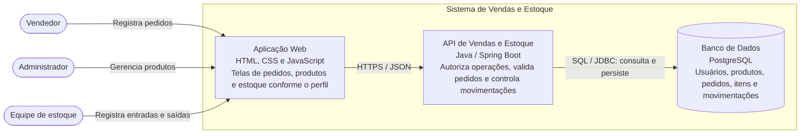
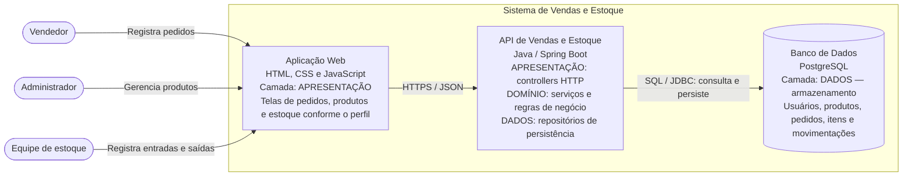

# Aula 4 — Sua vez de arquitetar

## Cenário

A empresa vende produtos por telefone ou em encontros presenciais. Os vendedores registram pedidos no sistema; o administrador cadastra e remove produtos da venda; a equipe de estoque controla o saldo, registra entradas e dá baixa nas saídas.

O cliente não acessa a aplicação diretamente: seu contato é com o vendedor. Por isso ele não foi incluído como usuário do software no diagrama de contexto. Não foram inventados sistemas externos obrigatórios para esse cenário.

## Decisões da proposta

- Uma aplicação web atende os três perfis. A API verifica as permissões: vendedor registra pedidos, administrador gerencia o catálogo e estoque registra movimentações.
- O pedido guarda itens, quantidades, preços e situação. O serviço valida produtos ativos, quantidades positivas e saldo disponível e reserva as unidades ao confirmar o pedido, evitando prometer o mesmo saldo a pedidos diferentes.
- A equipe de estoque confirma a saída física: o serviço reduz o saldo e libera a reserva em uma única transação. Cancelar um pedido ainda não expedido libera a reserva. Registrar uma entrada aumenta o saldo. Uma saída não pode gerar saldo negativo e a mesma saída de pedido não pode ser aplicada duas vezes.
- Retirar um produto da venda significa desativá-lo para novos pedidos, preservando seu histórico nos pedidos e nas movimentações já registrados.
- A persistência guarda os registros; as regras são aplicadas pelo domínio. As mudanças de reserva e saldo exigem controle de concorrência, por exemplo bloqueio do registro do produto dentro da transação.
- HTML/CSS/JavaScript, Java/Spring Boot e PostgreSQL são escolhas desta proposta arquitetural, não exigências adicionais do enunciado.

## 1. C4 nível 1 — Contexto

## 2. C4 nível 2 — Contêineres

## 3. Mesmo nível 2 — Camadas identificadas

Os dois diagramas de nível 2 mantêm os mesmos atores, contêineres e relações. A terceira entrega apenas acrescenta as responsabilidades de camada.

Uma camada lógica não precisa ser um contêiner separado. A API concentra controllers de apresentação, serviços de domínio e repositórios de dados no mesmo processo. O banco representa o armazenamento da camada de dados; as regras de negócio não ficam no banco. Essa distinção segue a discussão de camadas lógicas e físicas da aula 4.

| Parte | Camada / responsabilidade |
| --- | --- |
| Aplicação web | Apresentação: telas e entrada de dados. |
| Controllers da API | Apresentação: protocolo HTTP e tradução das entradas e saídas. |
| Serviços da API | Domínio: permissões, pedidos, reservas, catálogo e movimentações. |
| Repositórios da API | Dados: consultas e persistência. |
| Banco PostgreSQL | Dados: armazenamento dos registros. |

## Arquivos entregues

- [Contexto](c1-contexto.mmd).
- [Contêineres](c2-conteineres.mmd).
- [Contêineres com camadas](c2-camadas.mmd).

Os diagramas também estão incluídos neste README para visualização no GitHub. A notação utiliza Mermaid `flowchart`, como nos exercícios anteriores, para representar os níveis C4. Base: enunciado “Sua vez de arquitetar” e slides da aula 4 fornecidos pelo professor.
